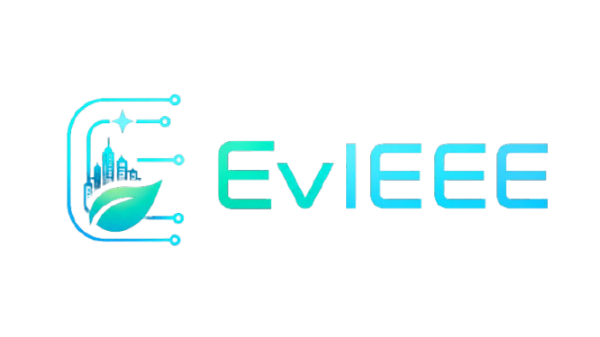

# EvIEEE: Smart City and Eco-Restoration Simulation


> **An Immersive WebXR Educational Platform built for the IEEE Metaverse Grand Challenge for Simulation Based Learning 2026.**

EvIEEE is an immersive, interactive 3D simulation platform designed to democratize complex concepts of sustainability, disaster mitigation, and smart city urban planning. Through a first-person WebXR experience, users are guided by an AI assistant named EvIEEE on a progressive journey across the Indonesian archipelago, transforming abstract spatial data and IoT technologies into an engaging, kids-friendly eco-adventure.

---

## 🎮 The Nusantara Missions
The simulation scales from micro-urban habits to macro-spatial restoration, representing the diverse ecological challenges of Indonesia.

*   **♻️ Level 1: Java (The Micro/Urban Focus)**
    *   **Crisis:** Urban pollution and poor waste management.
    *   **Mission:** Utilize the Smart Scanner to sort organic and non-organic waste, teaching users circular economy concepts (e.g., recycling paper into seed paper).
*   **🛡️ Level 2: Andalas (The Macro/Spatial Focus)**
    *   **Crisis:** Deforestation causing critical flood risks.
    *   **Mission:** Call upon the Eco-Drone to clear river debris, plant seed bombs, and provide sunlight/water to restore the forest and stop the flood.
*   **🚁 Level 3: Borneo (The Lungs of the World)**
    *   **Crisis:** Peatland fires and toxic smog trapping endangered wildlife.
    *   **Mission:** Deploy Rescue Drones to pinpoint and extinguish fires, saving trapped Orangutans and clearing the air.
*   **🌊 Level 4: Celebes (The Ocean's Heart)**
    *   **Crisis:** Marine waste and dying coral reefs.
    *   **Mission:** Pilot an IoT Rover submarine to clean toxic ocean waste and plant synthetic Bio-Corals to bring marine life back.
*   *Level 5 (Nusa) & Level 6 (Papua) are part of the scalable roadmap for future development.*

---

## ✨ Key Features
*   **Simulation-Based Learning:** Every level concludes with a **"Real World Impact"** lesson, bridging the gap between virtual gameplay and actual environmental awareness.
*   **Next-Gen UI/UX:** Features a sleek, responsive **Glassmorphism** interface (deep navy & cyan) that perfectly complements the 3D WebXR environment.
*   **Sequential State Machine:** Bug-free, HTML-driven interaction logic replacing clunky 3D raycasters, ensuring maximum accessibility for all ages.
*   **Dynamic Audio Manager:** Seamless background music transitions between the Nusantara Map lobby and active missions, complete with a global mute toggle.
*   **Certified Eco-Hero System:** A built-in progression tracker that rewards users who complete the simulation with a dynamically generated, personalized **PDF Certificate** featuring real-time timestamps and an official charter seal.

---

## 🛠️ Tech Stack
*   **Core 3D Engine:** [A-Frame](https://aframe.io/) (WebXR Framework)
*   **Styling:** [Tailwind CSS](https://tailwindcss.com/) (Utility-first CSS framework for responsive Glassmorphism UI)
*   **Logic & Interactions:** Vanilla JavaScript (ES6+) & DOM Manipulation
*   **Document Generation:** [jsPDF](https://github.com/parallax/jsPDF) (Client-side PDF generation)

---

## 🚀 How to Run Locally
Due to browser CORS policies regarding 3D models and audio files, this project must be run through a local web server.

1.  Clone this repository:
    ```bash
    git clone [https://github.com/yourusername/evieee-simulation.git](https://github.com/yourusername/evieee-simulation.git)
    ```
2.  Navigate to the project directory:
    ```bash
    cd evieee-simulation
    ```
3.  Start a local server. If you have Python installed, you can run:
    ```bash
    python -m http.server 8000
    ```
    *(Alternatively, use the VSCode "Live Server" extension or Node's `http-server`).*
4.  Open your browser and navigate to `http://localhost:8000`.

---

## 📜 Copyright & Acknowledgments
**Copyright: Created by Vallen for IEEE Metaverse Grand Challenge for Simulation Based Learning 2026.**

Built with passion for a sustainable future and a smarter Nusantara. 🌿
